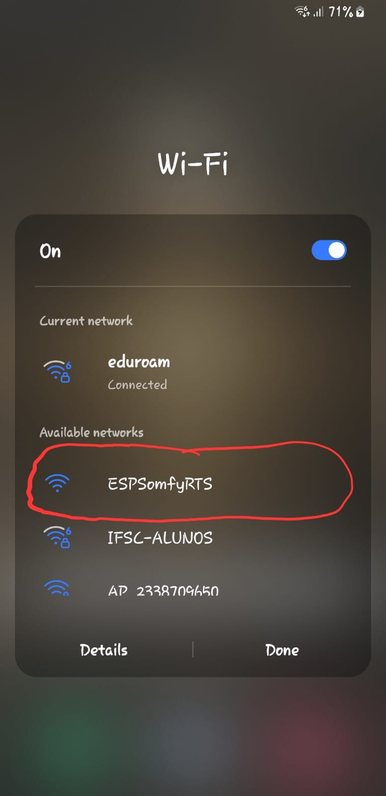
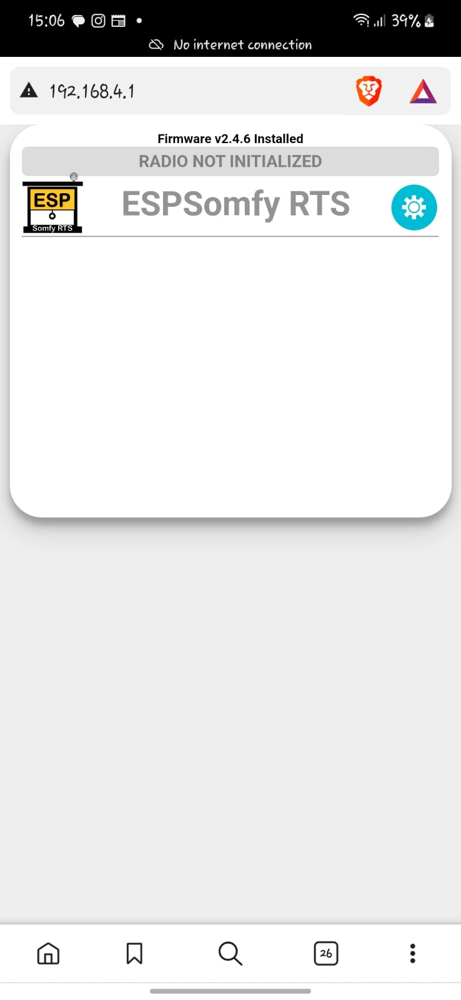
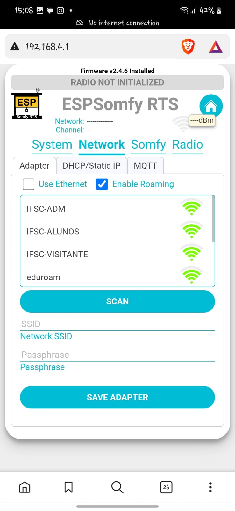
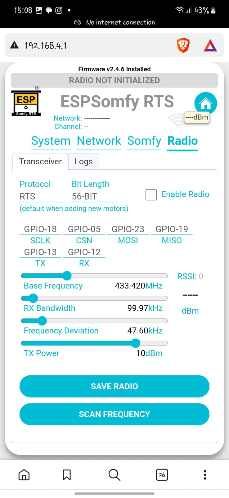
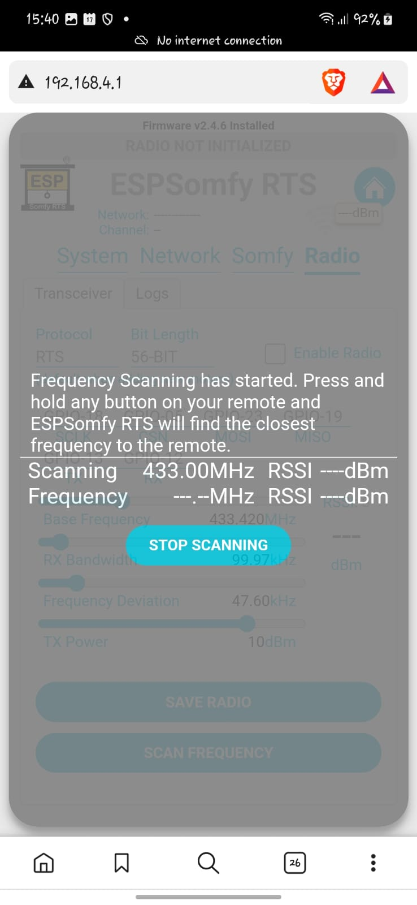
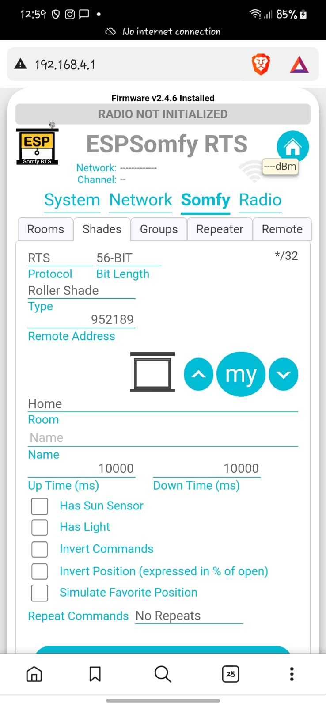
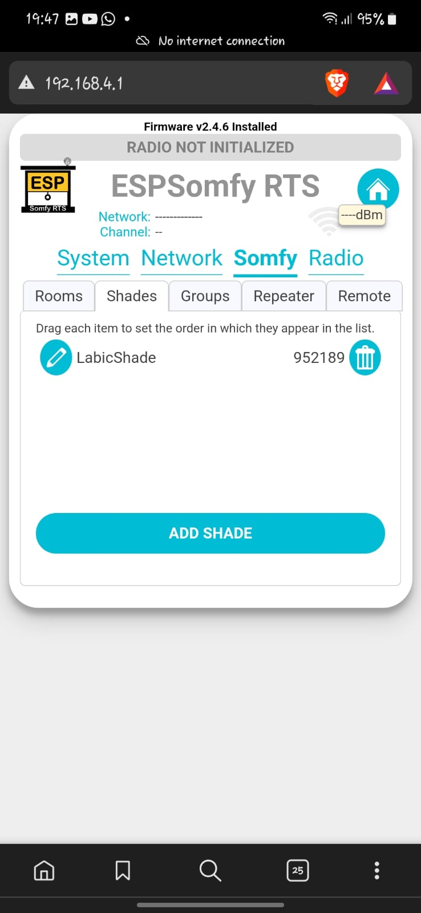
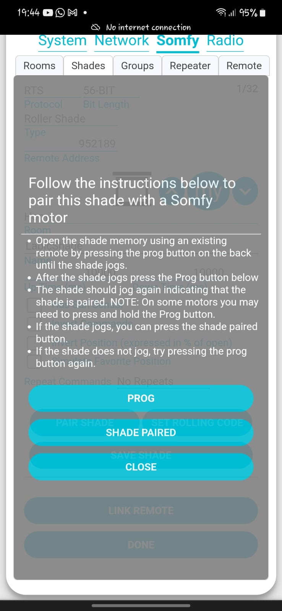

# Objetivo

Desenvolver um sistema microcontrolado acessível capaz de integrar circuitos atuadores de radiofrequência, como por exemplo persianas automá
ticas. Algo voltado para o ramo de Internet of Things (IoT).

Além disso, ele irá utilizar o protocolo Matter (desenvolvido pelas maiores empresas de tecnologia, especificamente para o ramo de IoT) para realizar a comunicação com o dispositivo microcontrolador (ESP 32).

# Como conectar à placa

Ao ligar a ESP32, o programa interno irá gerar uma rede para se conectar chamada de "ESPSomfy RTS". 



Após conectar, abrir o navegador do seu celular e ir para o endereço http://192.168.4.1 (página principal). Clique no ícone de engrenagem no canto superior direito para abrir a tela de configuração geral.



## Opção System
Primeiramente, na tela ```System```, na aba ```Options```, defina a Time/Zone. Basta tocar em cima da opção que irá aparecer e setar para o seu local (como estamos no Brasil é ETC/GMT-3).


## Opção Network
Na tela ```Network```, ao lado de System, há a opção ```Adapter```. Nela você pode escolher a rede ao qual se conectar. Basta clicar no botão azul ```Scan```, selecionar a sua rede local, colocar a senha, e tocar no botão ```SAVE ADAPTER```.



## Opção Radio
Na tela ```Radio```, opção ```Transceiver```, podemos setar o transceptor. Inicialmente, o ESPSomfyRTS iniciará com o transceptor desabilitado. 



Agora que a rede está conectada, você precisará garantir que os mapeamentos de pinos correspondam à fiação usada ao montar seu dispositivo (neste caso, os pinos que aparecem já setados são os corretos, então você não precisa mudar nada).

Seguimos então para selecionar o protocolo e o comprimento de bits usados ​​para seus motores. Se você não sabe que tipo de rádio para motor você possui, provavelmente é um protocolo RTS com um motor de 56 bits. Depois, é possível setar um protocolo e taxa de bits diferentes para cada motor. 

Uma ferramenta que pode ajudar nas configurações do protocolo é a opção de ```Log```, ao lado de Transceiver. Nela é possível ver quantos bits estão sendo enviados e qual tipo de protocolo está sendo usado. Ao visualizar a coluna Bits, você pode ver qual sinal de entrada daquele controle remoto está usando. Por exemplo, um sinal RTS de 56 bits será 56-S e um sinal RTS de 80 bits será 80-S. Se o protocolo for RTW, o -S será substituído por -W e, se o protocolo for RTV, o -S será substituído por -V.



Após essa verificação, clique na caixa de seleção ```Enable Radio``` e pressione o botão ```SAVE RADIO```. O ESPSomfy RTS agora habilitará o transceptor no modo de recepção para que você possa sintonizar seu rádio. Após a ativação do rádio, o cabeçalho ```Radio not Inicialized``` desaparecerá da tela. Se a mensagem não desaparecer, provavelmente há um problema com a seleção dos pinos ou das configurações do motor.

Os parâmetros de sintonia padrão provavelmente não são as melhores configurações para o seu transceptor. Para começar, selecione a largura de banda RX como 96,96 kHz e o desvio de frequência como 11,43 kHz. Você pode usar as setas do teclado para fazer o ajuste fino do valor. Em seguida, pressione o botão "Save Radio". Em seguida, usando um controle remoto a cerca de 90 cm de distância, pressione um dos botões. O ESPSomfy RTS deve captar o sinal e fornecer um valor RSSI (Indicador de Intensidade do Sinal Recebido). Este número mede a intensidade do sinal. Quanto mais próximo este valor estiver de 0, mais forte será o sinal recebido.

Cada vez que você pressionar um botão, o número ao lado do rótulo RSSI: deve ser incrementado. O valor abaixo é de um rádio DSUN e este é o melhor que consegui fazer a 90 cm. Lembre-se de que isso tem a ver com muitos fatores, mas se você estiver recebendo -60 dBm consistentemente, ainda é melhor do que a recepção no motor. O alcance dos controles remotos Somfy não é bom.


## Opção Somfy
### Rooms

O ESPSomfy RTS permite que você separe seus motores por salas. Na tela Somfy, clique no botão ```ADD ROOM```.

### Shades

Na opção ```Shades```, clique no botão ```ADD SHADE```. Irá aparecer a seguinte tela de configuração:



No campo ```Protocol```, você pode preencher com RTS, RTW ou RTV. Se não for RTS, você terá que verificar no manual do seu motor a qual protocolo ele pertence.

No campo ```Bit Length```, a maioria dos motores Somfy utiliza um protocolo de 56 bits. No entanto, alguns utilizam 80 bits para comunicação e exigem que você selecione a configuração de 80 bits para o comprimento de bits. A maneira mais fácil de identificar esse cenário é abrir o registro de quadros (Log), como descrito na seção [Opção Rádio.](#opção-radio)

No campo ```Type```, você pode selecionar o tipo de motor que você irá adicionar. O tipo que for escolhido irá acompanhar algumas características extras e específicas. Eis alguns:

| Nome | Descrição | Características |
|:-----:|:--------:|:----------------:|
| Roller Shade | Folha de tecido sólido que é levantada ou abaixada usando um rolo na parte superior da abertura. | Up, Down, My |
| Shutter | Uma cobertura semissólida composta de lâminas interligadas que são levantadas ou abaixadas usando um rolo na parte superior da abertura. | Up, Down, My, Sun |
| Blind | Lâminas frouxamente conectadas que são levantadas ou abaixadas por meio de um mecanismo de tração. Esses motores também costumam conter algum mecanismo de inclinação para girar as lâminas, abrindo ou fechando-as. | Up, Down, My, Sun, Tilt |
|...|...|...|

No campo ```Remote Adress```, é esperado que a ESP32 gere um identificador único de 24 bits. Você não deve mudar nada.

No campo ```Name``` adicione o nome do Shade que você está usando, exemplo: *SalaShade* ou *MotorSala.*

Os campos ```Up Time``` e ```Down Time``` indicam o número de milissegundos que a persiana leva para se deslocar da posição abaixada para a posição levantada e vice-versa. Este valor é fornecido em milissegundos, portanto, se você estiver contando o número de segundos e levar 10 segundos para percorrer todo o percurso, isso equivale a 10.000 milissegundos. Lembrando que o tempo de fechamento pode ser diferente do tempo de abertura, dependendo do motor.

A caixa de diálogo ```Invert Commands``` é para os casos em que, ao pressionar o botão para cima no controle remoto, a persiana ou cortina se move para baixo, o toldo se estende ou a cortina se fecha. Isso significa que o motor não está configurado corretamente e você deve inverter sua direção.

O campo ```Repeat Commands``` serve para quando o motor não entende que está recebendo um sinal. Às vezes isso se deve à economia de bateria, então pode-se colocar 1 neste campo. Se mesmo assim, não funcionar, pode-se incrementar uma unidade a cada tentativa, até o máximo de 5. Acima disso, é necessário verificar se não há nenhuma interferência entre o motor e a ESP32, ou revisar as configurações.

Após todas estas configurações, clique no botão **"ADD SHADE".**

Se quiser fazer alguma alteração no shade criado, com a opção ```Shades``` selecionada, irá aparecer uma caneta azul ao lado do ambiente que você setou, como na imagem abaixo:



Ao clicar nela, você volta para as configurações inicias que foram descritas nesta seção até aqui.

## Pareando com um motor
Estando dentro da janela ```Somfy```,  opção ```Shades```, ao final da página clique no botão ```PAIR SHADE```. Irá aparecer a seguinte tela:




A memória do motor armazena o endereço de cada controle remoto do qual recebe comandos. Portanto, na primeira etapa, você abre a memória pressionando o botão **PROG** em um **CONTROLE REMOTO** por tempo suficiente para que ele entre em funcionamento. Em seguida, pressione o botão ```PROG``` na **TELA DO SEU CELULAR** para que ele entre em funcionamento novamente. Então pressione o botão ```SHADE PAIRED```.